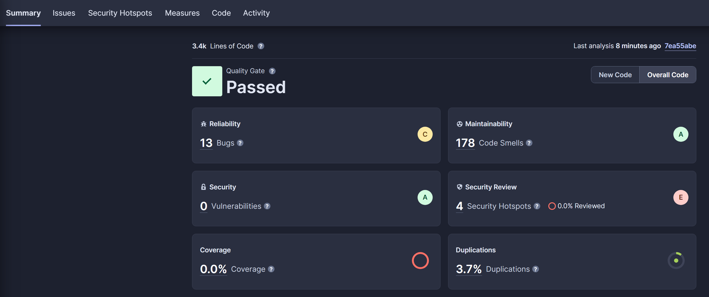
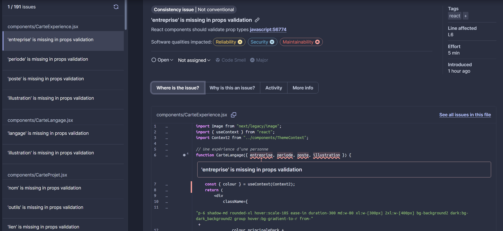
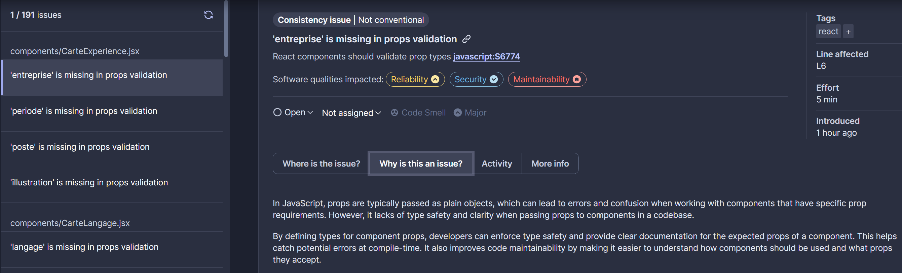
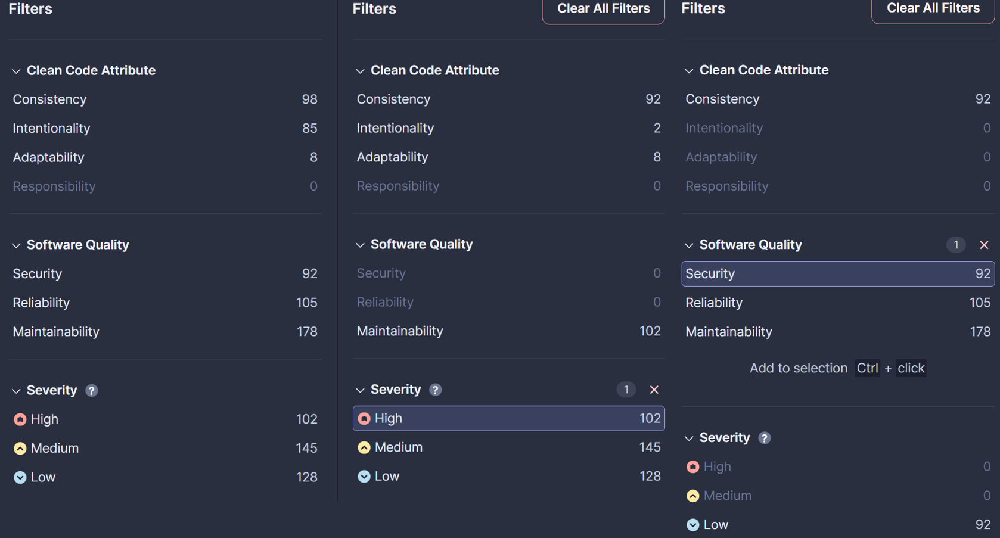
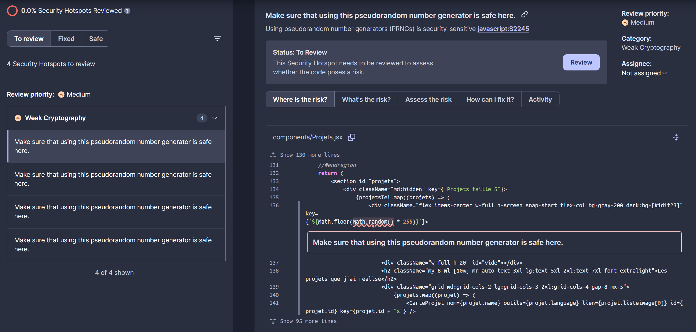
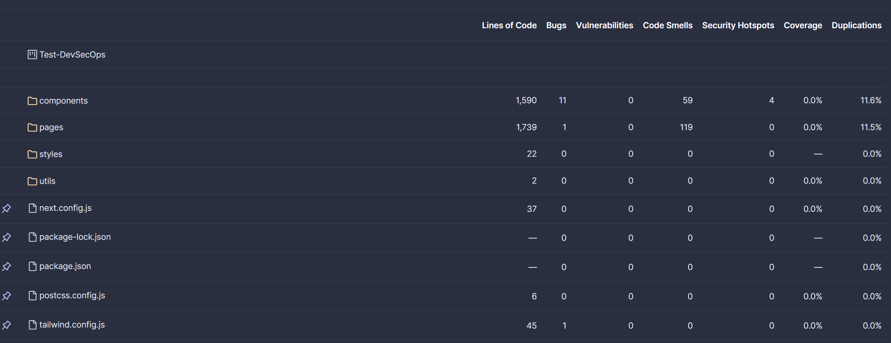
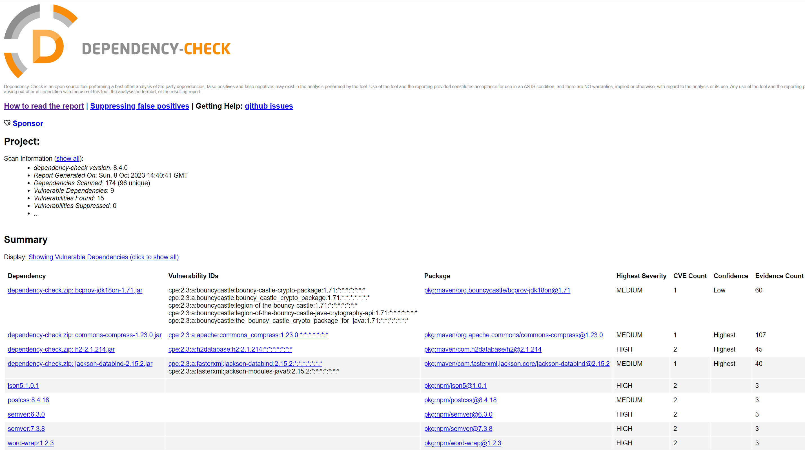
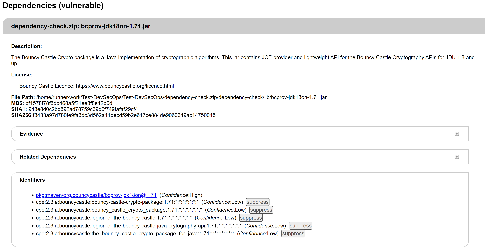
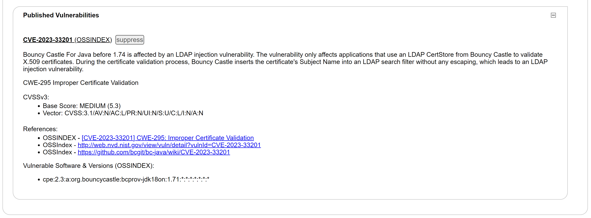
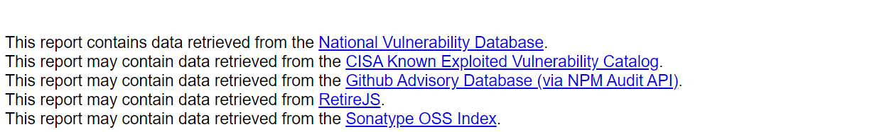

# Test DevSecOps

## Description

Ceci est un projet de test pour des outils **DevSecOps**.
J'ai réutilisé un de mes projets de développement Web NextJS pour faire ce test. J'ai volontairement laissé ce projet qui a maintenant près d'un an sans mise à jour, malgré les recommandations de sécurité de `GitHub` et de `npm`.

## Outils DevSecOps utilisés

### SAST - SonarQube

**SonarQube** est un outil de SAST (Static Application Security Testing) qui permet de détecter des vulnérabilités dans le code source d'une application.

### SCA - OWASP Dependency Check

OWASP Dependency Check est un outil de SCA (Software Composition Analysis) qui permet de détecter des vulnérabilités dans les dépendances d'une application.

## GitHub Actions

J'ai configuré **GitHub Actions** pour qu'il exécute les tests de sécurité à chaque push sur la branche `main` du projet.

Le code de la configuration de **GitHub Actions** est disponible dans le fichier [`.github/workflows/main.yml`](.github/workflows/main.yml).

J'y configure tout d'abord le fait que **GitHub Actions** doit s'exécuter à chaque push sur la branche `main` du projet.

Ensuite, je lance le job `SAST-SonarQube` qui va lancer l'analyse de **SonarQube** sur un environnement Ubuntu *latest*. Ce dernier envoie les résultats de l'analyse à **SonarCloud**.

Enfin, je lance le job `SCA-OWASP-Dependency-Check` qui va lancer l'analyse de **OWASP Dependency Check**, lui aussi sur un environnement Ubuntu *latest*. Ce dernier génère un rapport `HTML` qui est ensuite zippé et envoyé en tant qu'artefact à **GitHub Actions**.

## Rapports d'analyse

### SonarQube

J'ai configuré **SonarQube** pour qu'il analyse le code source de l'application et qu'il envoie les résultats à **SonarCloud**, un service en ligne de **SonarQube**.
L'interface disponible sur **SonarCloud** est identique à celle de la version locale de **SonarQube**, mais peut recevoir les résultats de GitHub Actions.

#### Sommaire

C'est le sommaire du rapport d'analyse de **SonarCloud**.

Ici on peut voir que le test de Qualité global du code est réussi, avec notamment 0 vulnérabilités de sécurité détectées et une note de A en Maintenabilité.
Cependant une note de C en Fiabilité est attribuée à cause de la présence supposée de 13 bugs dans le code.
La note de E a été attribuée en Revue de Sécurité, avec 4 supposées vulnérabilités de sécurité.

#### Problèmes

L'onglet **Issues** permet de voir avec plus de détail les problèmes détectés par **SonarQube**.
On peut notamment ouvrir chaque problème pour voir le code source concerné et la raison pour laquelle **SonarQube** a détecté un problème.

Dans le cas ci-dessus c'est par exemple un problèm purement lié à du JavaSript, **SonarQube** considérant comme un problème l'absence de vérification de type sur une variable.

Les filtres sont très pratiques pour trier les problèmes par type, par gravité, par composant, etc.

Dans le cas ci-dessus on peut voir que les problèmes marqués d'une sévérité **High** ne concernent que la maintenabilité du code, et non la sécurité.

#### Security Hotspots

L'onglet **Security Hotspots** permet de voir les problèmes de sécurité détectés par **SonarQube**.
Dans ce cas-ci, il n'y a qu'un seul problème de sécurité détecté 4 fois, qui est d'après **SonarQube** une vulnérabilité potentielle sur le générateur de nombres aléatoires utilisé par l'application.

Dans ce cas-ci, il ne s'agit pas d'un réel problème de sécurité, **SonarQube** manque de contexte pour savoir si le générateur de nombres aléatoires est utilisé pour des opérations critiques ou non. Dans cette situation le générateur de nombres aléatoires est utilisé pour générer des clés d'indexation de baliises HTML, ce qui n'est pas critique.

#### Code

L'onglet **Code** permet de voir le code source de l'application, avec pour chaque dossier et fichier le nombre de lignes analysées et le nombre de problèmes détectés.

### OWASP Dependency Check

J'ai configuré **OWASP Dependency Check** pour qu'il analyse les dépendances de l'application et qu'il génère un rapport `HTML` qu'il zippé et envoie en tant qu'artefact à GitHub Actions. Celui-ci peut ensuite être téléchargé et consulté après chaque exécution de GitHub Actions.

#### Rapport

Le rapport `HTML` généré par **OWASP Dependency Check** est un seul long fichier `HTML` contenant toutes les informations sur les vulnérabilités détectées.

Il contient un sommaire qui permet de voir rapidement les vulnérabilités détectées.

#### Détails

Le rapport contient ensuite les détails de chaque vulnérabilité détectée, avec notamment le nom de la vulnérabilité, sa description, sa sévérité, le composant concerné, etc.

A la fin du rapport, les sources des vulnérabilités sont listées.

